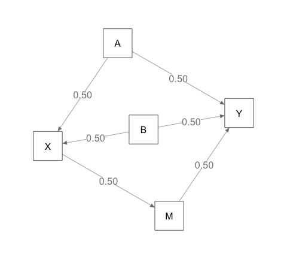
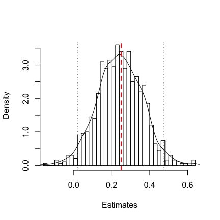
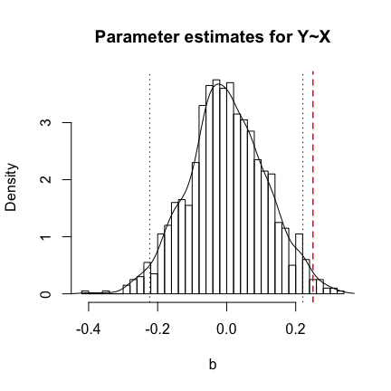
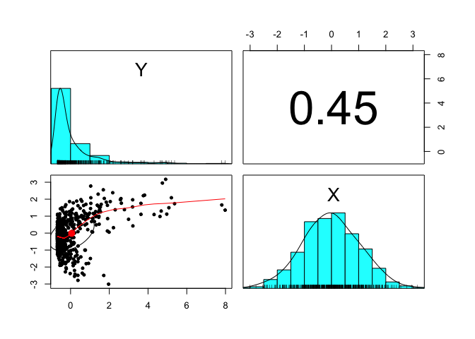

``` r
library(regsim)
library(dagitty)
library(semPlot)
library(lavaan)
library(psych)
```

`regsim` is an `R` package to make simulation quick and easy. It can be installed from github with the following `R` code.

``` r
# the following two lines need only to be run once 
install.packages("devtools")
devtools::install_github("mcbeem/regsim")

# add regsim's functions to R namespace so they can be used
library(regsim)
```

Example 1: Confounders and mediators
====================================

A researcher envisions the following true data-generating process:


And is interested in estimating the effect of *X* on *Y* using a linear regression model of the following form:

*Y*<sub>*i*</sub> = *b*<sub>0</sub> + *b*<sub>1</sub>(*X*<sub>*i*</sub>)+...+*e*<sub>*i*</sub>

where ... potentially contains the effect of a set of *covariates* or *adjustment variables*. In this case, those covariates could include any combination of *A*, *B*, or *M*. What are the consequences of different choices? Simulation is a useful technique for exploring the results of analytic decisions. One reason it is so useful is that the true model, and the correct effect of *X* → *Y*, is known. Thus, the estimates produced by linear regression can be compared to the known, true values.

Defining the Data Generating (True) Model
-----------------------------------------

The process of specifying the data generating model is simple.

1.  **Sketch the path diagram describing the true model**. The process begins by sketching out a path diagram of the relationships between the variables. The arrows indicate not only causation, but in this case also imply a linear functional form. Each arrow must be assigned a *path coefficient*; a regression slope describing how much the downstream variable will change in response to an isolated-one unit change of the upstream variable.

2.  **Classify the variables**. Next, the variables in the diagram are classified as either **exogenous** or **endogenous**. An exogenous variable has no arrow directed towards it; it has no in-system causes. An endogeous variable has at least one arrow directed toward it. In our example, variables *A* and *B* are exogenous, while *X*, *M*, and *Y* are endogenous.

3.  **Write models for the endogenous variables**. Each exogenous variable must be described in terms of its causes. The syntax is similar to `R`'s model formula used in `lm()` and many other model-fitting routines. In our example path diagram, *X*, *M*, and *Y* were endogenous, so a model for each one will need to be provided.

Let's begin by examining *X*, which is caused by *A* and *B* according to our diagram. In `R`'s formula syntax, we would write:

``` r
X ~ A + B
```

Where the `~` character is read "predicted by" or "regressed on." This formula corresponds to a regression model of the form:

*X*<sub>*i*</sub> = *b*<sub>0</sub> + *b*<sub>1</sub>(*A*<sub>*i*</sub>)+*b*<sub>2</sub>(*B*<sub>*i*</sub>)+*e*<sub>*i*</sub>

Since we are specifying the true model, we must provide values for parameters *b*<sub>1</sub> and *b*<sub>2</sub>. The intercept, *b*<sub>0</sub>, and the residual variance *e*<sub>*i*</sub> are nuisance parameters in many simulation application. We do not need to choose values for them when using `regsim()` to simulate data. The `regsim()` function uses the `simulateSEM()` function from the `lavaan` package to do the data generation.

Let's choose values of 0.5 for both *b*<sub>1</sub> and *b*<sub>2</sub>. The model for *X*, expressed in the proper syntax for `regsim()`, is as follows.

``` r
X ~ .5*A + .5*B
```

We must do the same for the endogenous variables *M* and *Y*. Variable *M* has only one arrow pointing to it, so its model has only one predictor variable, *X*. Choosing 0.5 as the path coefficient for *X* → *M*, *M*'s model is written:

``` r
M ~ .5*X
```

Finally, *Y* is caused by *A*, *B*, and *M*, so its model must include these variables. Sticking with 0.5 as our arbitrary value for all the path coefficients, the model for *Y* is written:

``` r
Y ~ .5*A + .5*B + .5*M
```

We will create an object called `true.model` that will be passed to `regsim()` to describe the model. It will consist of a quoted string including all three of the models specified above. These can all go on one line, or you can separate them with line breaks for readability.

``` r
true.model <- "X ~ .5*A + .5*B
               M ~ .5*X
               Y ~ .5*M + .5*A + .5*B"
```

By default, `regsim()` will sample the exogenous as well as the residuals for the endogenous variables from independent normal distributions. You can alter the distribution, to some extent, via the optional `kurtosis=` and `skewness=` arguments.

Defining the Fitted Model
-------------------------

The fitted model is the regression model that will be fitted to the simulated data sampled from the true model. This model is specified using `R` formula syntax. Here, we will specify a simple regression of *Y* on *X* with no covariates, and will save it an object called `fit.model`. **Note**: the fitted model's syntax must be a quoted string.

``` r
fit.model <- "Y ~ X"
```

Setting the other simulation parameters
---------------------------------------

We must make a few final decisions before running `regsim()`. They are:

-   `reps`: The number of times that the simulation-estimation process will be repeated. Here there is a tradeoff between the accuracy of the results and computation time. I suggest at least 1,000 reps, hopefully more, before interpreting the results too seriously.

-   `n`: The sample size generated for each rep.

-   `targetparm`: Which parameter's estimate and standard error should be scrutinized? This is expressed as a quoted string. It must be a variable from the right-hand side of the fitted model.

-   `targetval`: The true value of the relationship between the target parameter and the response variable as specified in the data generating model. In the path diagram considered in this example, the effect of *X* on *Y* is completely mediated by *M*.

By path tracing rules, the total effect of one variable on another when the effect is mediated is equal to the direct effect plus the indirect (mediated) effect. In this case, the direct effect is zero, because there is no direct *X* → *Y* path in the data generating model. The indirect effect is the product of all the path coefficients in the chain *X* → *M* → *Y*. In this case, the indirect effect is .5 × .5 = .25. We will use this value as our target value for *X*'s effect on *Y*.

Doing the simulation
--------------------

The simulation is performed using the `regsim()` function. The `true.model` and `fit.model` objects, previously created, are passed as arguments. The simulation results are assigned to the `result_1a` object. A random number seed has been specified for reproducibility.

Note that, by default, `regsim()` does not impose a standardized metric on the generated variables, so users do not have to worry about implying variable correlations greater than one. In other words, when `standardized=FALSE`, path coefficients can be freely chosen.

``` r
set.seed(123)

result_1a <- regsim(reps=1000, n=100, true.model=true.model, 
                 fit.model=fit.model, targetparm="X",
                 targetval=.25)
```

Before examining the results, let's verify that we specified the data generating model correctly. Running `plot()` on the `regsim()` output will produce a path diagram corresponding to this model.

``` r
plot(result_1a)
```


This plot looks correct, but the path coefficients for *A* → *Y* and *B* → *X* are superimposed. We can try an alternate layout for the graph. See `?lavaan::semPaths` for details on the options (under 'layout'). In this case, the `"spring"` layout works better and avoids overplotting.

``` r
plot(result_1a, layout="spring")
```



Having verified that the data-generating model was set up correctly, let's examine the `regsim()` output.

``` r
result_1a
```

    ## $targetval
    ## [1] 0.25
    ## 
    ## $expected.b
    ## [1] 0.5843389
    ## 
    ## $bias
    ## [1] 0.3343389
    ## 
    ## $analytic.SE
    ## [1] 0.10401
    ## 
    ## $empirical.SE
    ## [1] 0.09922978
    ## 
    ## $analytic.CI
    ##      2.5%     97.5% 
    ## 0.3779346 0.7907433 
    ## 
    ## $empirical.CI
    ##      2.5%     97.5% 
    ## 0.3788186 0.7775613 
    ## 
    ## $coverage
    ## [1] 0.104
    ## 
    ## $RMSE
    ## [1] 0.3487395
    ## 
    ## $adjustment.sets
    ##  { A, B }

-   `$targetval` The true value of the target parameter, *β*, which was specified when the function was called. It is used to calculate bias, RMSE, and coverage.

-   `$expected.b` The mean value of the target parameter estimate across all the simulated repetitions, $E(\\hat{b})$. This value should closely approximate the corresponding true value.

-   `$bias` Bias is calculated as the difference between the true value of the target parameter and the mean value of its estimate across repetitions. $E(\\hat{b}) - \\beta)$. This value should be close to zero when the model is correctly specified.

-   `analytical.SE` The average estimated standard error for the target parameter across the repetitions. The analytical standard error should closely approximate the empirical standard error if the model is correctly specified. A violation of certain regression assumptions can cause it to diverge from the empirical standard error.

-   `empirical.SE` The calculated standard deviation of the parameter estimates $\\hat{b}$. The empirical standard error is an estimated of what the sampling variability of the parameter actually is.

-   `$analytic.CI` The mean lower and upper analytic confidence interval boundaries for the target parameter across repetitions based on the limits specified by the `interval=` argument. These should closely approximate the empirical confidence interval boundaries; when this does not occur, an assumption violation has likely occurred.

-   `$empirical.CI` The empirical percentiles of the estimated values of the target parameter at the limits specified by the `interval=` argument. By default these will be the 2.5th and 97.5th percentiles, corresponding to the 95% empirical confidence interval.

-   `$coverage` The proportion of repetitions in which the true value of the target parameter, *β*, is contained in the analytic confidence interval. The coverage rate should should approximate the confidence level for the interval if model assumptions are met.

-   `$RMSE` The root mean squared error, calculated as $\\sqrt{E\[(\\hat{b}) - \\beta)\]^2}$. The RMSE is includes contributions from both sampling error and bias and is a single-value summary of how close, on average, estimates come to the true value.

-   `$adjustment.sets` The set(s) of covariates that, if included in the fitted regression model (argument `fit.model=`), would allow for unbiased estimation of the target parameter. The adjustment sets are calculated using the `adjustmentSets()` function of the `dagitty` package. When the set is empty, no covariates are required.

The `regsim()` output includes a few other components which are not printed but are nonetheless available. The full contents can be inspected by running `str()` on the `regsim()` output. The other components of output include:

-   `$true.model` The data generating (true) model.

-   `$fit.model` The fitted model.

-   `$b` The vector of parameter estimates across repetitions.

-   `$data` A simulated dataset from the first repetition. (The data for the other repetitions is not available).

-   `$true.DAG` The data generating model expressed as a DAG of class `dagitty`.

### Interpreting the results

The results indicate that the fitted model is producing a biased estimated of the true effect of *X* → *Y*. This is can clearly be observed in the discrepancy between the mean estimated value (`$expected.b`) and the true value, which is also represented in the `$bias` value. The empirical and analytic standard error are quite close to one another, as are the confidence intervals, indicating that the problem with this model is in its fixed (structural) component. The bias results in a coverage rate that is far below its 95% nominal value. The RMSE is much larger than the standard error as a result of the bias.

Because the fitted model is misspecified, the estimated effect of *X* → *Y* is biased. `regsim()` returns the parameter estimates across all of the repetitions in a list component `$b`. Below is a histogram with a superimposed density plot of the parameter estimates. The true value of the relationship is indicated with a dashed vertical red line. The locations of the 2.5th and 97.5th percentiles (representing the empirical 95% confidence interval) are indicated with dotted vertical lines.

``` r
hist(result_1a$b, breaks=30, freq=FALSE,
     main="Parameter estimates for Y~X", xlab="b")

points(density(result_1a$b), type='l')

abline(v=.25, col="red", lty="dashed", lwd=1.5)

abline(v=result_1a$empirical.CI, lty="dotted")
```


We can visualize the distribution of the simulated data in lots of ways. One of the best and easiest is with the `pairs.panels()` function in the `psych` package. The `regsim()` output component `$data` contains the simulated data from the first repetition, which can be passed to `pairs.panels()` or any other function.

``` r
pairs.panels(result_1a$data)
```


### Obtaining an Unbiased Estimate of the Effect of X on Y

The `$adjustment.sets` output indicates the source of the problem: variables *A* and *B* must be included in this model as covariates in order to correctly estimate the *X* → *Y* effect. Let's correctly specify this model and re-run the simulation.

The `fit.model=` argument of the code is altered to include *A* and *B* in the model formula.

``` r
result_1b <- regsim(reps=1000, n=100, true.model=true.model, 
                 fit.model="Y~X+A+B", targetparm="X",
                 targetval=.25)

result_1b
```

    ## $targetval
    ## [1] 0.25
    ## 
    ## $expected.b
    ## [1] 0.2435049
    ## 
    ## $bias
    ## [1] -0.006495071
    ## 
    ## $analytic.SE
    ## [1] 0.1133802
    ## 
    ## $empirical.SE
    ## [1] 0.1167926
    ## 
    ## $analytic.CI
    ##       2.5%      97.5% 
    ## 0.01844698 0.46856288 
    ## 
    ## $empirical.CI
    ##       2.5%      97.5% 
    ## 0.02176829 0.47546433 
    ## 
    ## $coverage
    ## [1] 0.942
    ## 
    ## $RMSE
    ## [1] 0.1169148
    ## 
    ## $adjustment.sets
    ##  { A, B }

The results indicate good performance. Bias is very low, the coverage rate is nearly 95%, there is close correspondence between the analytic and empirical standard error and confidence intervals, and the RMSE is dominated by sampling error.

An updated histogram / density plot of the parameter estimates illustrate that they are now centered on the true value of the parameter.

``` r
hist(result_1b$b, breaks=30, freq=FALSE,
     main="Parameter estimates for Y~X", xlab="b")

points(density(result_1b$b), type='l')

abline(v=.25, col="red", lty="dashed", lwd=1.5)

abline(v=result_1b$empirical.CI, lty="dotted")
```



### Misspecifying the Model by Conditioning on the Mediator

In general, downstream descendents of the target parameter should not be included as covariates in an analysis. The only exception would be when explicit mediation modeling is intended. What happens if *M* is added to the model as a covariate, in addition to *A* and *B*? Simulation can answer that question.

``` r
result_1c <- regsim(reps=1000, n=100, true.model=true.model, 
                 fit.model="Y~X+A+B+M", targetparm="X",
                 targetval=.25)

result_1c
```

    ## $targetval
    ## [1] 0.25
    ## 
    ## $expected.b
    ## [1] 0.0003883205
    ## 
    ## $bias
    ## [1] -0.2496117
    ## 
    ## $analytic.SE
    ## [1] 0.114455
    ## 
    ## $empirical.SE
    ## [1] 0.1122119
    ## 
    ## $analytic.CI
    ##       2.5%      97.5% 
    ## -0.2268336  0.2276103 
    ## 
    ## $empirical.CI
    ##       2.5%      97.5% 
    ## -0.2231423  0.2207332 
    ## 
    ## $coverage
    ## [1] 0.417
    ## 
    ## $RMSE
    ## [1] 0.2736511
    ## 
    ## $adjustment.sets
    ##  { A, B }

As the results indicate, conditioning on the mediator is a bad idea. It results in an intensely biased estimate of the effect of *X* on *Y*. In fact, the average estimated effect across all the repetitions is now zero.

``` r
hist(result_1c$b, breaks=30, freq=FALSE,
     main="Parameter estimates for Y~X", xlab="b")

points(density(result_1c$b), type='l')

abline(v=.25, col="red", lty="dashed", lwd=1.5)

abline(v=result_1c$empirical.CI, lty="dotted")
```



Example 2: Violating distributional assumptions
===============================================

The `regsim()` function can generate non-normal data via the optional `skewness=` and `kurtosis=` arguments. (These are passed to `lavaan`'s `simulateData` function via `...`).

In this case the model will be a simple regression of *Y* on *X*, but the variables will be generated tuch they they are skewed and kurtotic. The `skewness=` and `kurtosis=` arguments expect a vector of these values for each variable in the data-generating model. However, I do not understand how the underlying `simulateData()` function orders the variables. Thus, I find it necessary to experiment with the order, each time plotting the the first generated dataset (via the `$data` output component) until the desired result is obtained.

I intend to generate data such that *Y* is severely skewed and *X* is not. I will try specifying `skewness=c(4,0)`, hoping that the skewness will be applied to *Y*. Also, it is important to note that skewness and kurtosis are not independent; skewness implies kurtosis. If *κ* is the full kurtosis of a distribution, and *γ* is the skewness, then the following inequality must be satisfied.

*κ* ≥ 1 + *γ*<sup>2</sup>

Non-normal data generation in `regsim()` is based on the algorithm presented by Vale and Maurelli (1983, as implemented in `lavaan`'s `simulateData()` function) and is quite sensitive to the kurtosis value. Successful convergence appears to require kurtosis values well above those that would satistify the inequality given above. Through trial and error I discovered that a kurtosis value of 26 or higher is needed to simulate data with a skewness of ±4.

``` r
result_2 <- regsim(reps=1000, n=500, true.model="Y~.5*X", fit.model="Y~X", targetparm="X", targetval=.5, kurtosis=c(26, 0), skewness=c(4, 0))
```

If the provided kurtosis value is too small for the skewness, you will see the following error message.

    ## Warning in fleishman1978_abcd(skewness = SK[i], kurtosis = KU[i]): lavaan
    ## WARNING: ValeMaurelli1983 method did not convergence, or it did not find
    ## the roots

In this case, you should not trust `regsim()`'s output!

Next, I examine the `$data` with `psych`'s `pairs.panels()` function.

``` r
pairs.panels(result_2$data)
```



The plot show that the *Y* variable was skewed as intended.

Now let's examine the simulation results.

``` r
result_2
```

    ## $targetval
    ## [1] 0.5
    ## 
    ## $expected.b
    ## [1] 0.4997811
    ## 
    ## $bias
    ## [1] -0.0002188914
    ## 
    ## $analytic.SE
    ## [1] 0.04450613
    ## 
    ## $empirical.SE
    ## [1] 0.08573579
    ## 
    ## $analytic.CI
    ##      2.5%     97.5% 
    ## 0.4123382 0.5872240 
    ## 
    ## $empirical.CI
    ##      2.5%     97.5% 
    ## 0.3393903 0.6701404 
    ## 
    ## $coverage
    ## [1] 0.696
    ## 
    ## $RMSE
    ## [1] 0.08569319
    ## 
    ## $adjustment.sets
    ##  {}

The results are unbiased, but the analytic standard errors are wrong. In fact, it is about half the magnitude that it should be. Consequently, the analytic 95% confidence interval is too narrow, and the coverage rate is only about 70%. A hypothesis test for this parameter would be *liberal*, meaning that its long-run false positive rate would be much higher than the alpha criterion should allow.

The regression assumption that has been violated in this case is that the distribution of the residuals does not follow a normal distribution. The strutural part of the model is fine. The incorrect residual distribution manifests as an improperly-shaped shaped sampling distribution for the parameter estimates.

The parameter estimates are stored in the output component `$b`. In the code below, I will make a density plot of the empirical sampling distribution. I will then overlay the analytic sampling distribution (the blue dotted curve). When the regreesion assumptions are met, these two distributions are identical in expectation. But they diverge when assumptions are violated. The true value is denoted by the red vertical line.

``` r
plot(density(result_2$b, adjust=1.2), ylim=c(0,10), 
     main="Empirical versus analytic sampling distribution")

x <- seq(.1, 1, by=.01)
y <- dnorm(x, mean=result_2$expected.b, sd=result_2$analytic.SE)
points(x, y, type="l", lty="dotted", col="blue")

abline(v=.5, col="red", lty="dashed")
```


Not only is the empirical sampling distribution platykurtotic, it is also slightly skewed to the right.

This is a rather extreme example of nonnormality. Linear regression works reasonbly well for minor departures from the normality assumption.

Example 3: Measurement error
============================

Measurement error is a ubiquitous feature of real data. Linear regression models assume that the predictor variables are measured without error. No such assumption is made about the response variable. We can explore this issue with simulation.

The **reliability** of a variable describes the proportion of its variance that is true score rather than measurement error. Many assessments in psychology have reliability coefficients of 0.7 to 0.9.

Measurement error in predictor variables
----------------------------------------

Let us imagine that we can measure variable *X* with a reliability of 0.8. According to classical test theory, *X* is composed of a true score component *X*<sub>*t**r**u**e*</sub>, a measurement error component *X*<sub>*e**r**r**o**r*</sub>. The observed values of this variable, which are contaminated with measurement error, is *X*<sub>*o*</sub>*b**s*. *X*<sub>*t**r**u**e*</sub> and *X*<sub>*e**r**r**o**r*</sub> are latent variables that cannot be observed.

The situation can be represented by the following path diagram.


Note that there is no path from *X*<sub>*o*</sub>*b**s* to *Y*. *Y* is caused by the true value, *X*<sub>*t**r**u**e*</sub>, and not by the observed *X*<sub>*o**b**s*</sub>. The path coefficients *X*<sub>*t**r**u**e*</sub> → *X*<sub>*o**b**s*</sub> and *X*<sub>*e**r**r**o**r*</sub> → *X*<sub>*o**b**s*</sub> can be manipulated to control the reliability coefficient of *X*<sub>*o**b**s*</sub>.

Let us imagine the exogenous variables, *X*<sub>*t**r**u**e*</sub> and *X*<sub>*e**r**r**o**r*</sub>, exist on a standardized metric and thus both have variances of one. According to classical test theory, the observed score equals the true score plus error.

The path coefficient for *X*<sub>*e**r**r**o**r*</sub> → *X*<sub>*o**b**s*</sub> is also dictated by the desired reliability. It should be set to one minus the square root of the reliability.

The code to define the data generating model is as follows.

``` r
true.model <- "X_obs ~~ 0*X_obs
               X_obs ~ 1*X_true + .25*X_error
               Y ~ .5*X_true"
```

Next, we run the simulation, being sure to set the `standardized=` argument to `TRUE`. Also note that the target value I have set is equal to the effect of *X*<sub>*t*</sub>*r**u**e* → *Y*, not the zero effect of *X*<sub>*o**b**s*</sub> → *Y*.

``` r
result_3a <- regsim(reps=1000, n=300, true.model=true.model, fit.model="Y~X_obs", targetparm="X_obs", targetval=.5)

result_3a
```

    ## $targetval
    ## [1] 0.5
    ## 
    ## $expected.b
    ## [1] 0.4704867
    ## 
    ## $bias
    ## [1] -0.02951327
    ## 
    ## $analytic.SE
    ## [1] 0.05678875
    ## 
    ## $empirical.SE
    ## [1] 0.05841299
    ## 
    ## $analytic.CI
    ##      2.5%     97.5% 
    ## 0.3587289 0.5822445 
    ## 
    ## $empirical.CI
    ##      2.5%     97.5% 
    ## 0.3547993 0.5866585 
    ## 
    ## $coverage
    ## [1] 0.915
    ## 
    ## $RMSE
    ## [1] 0.0654194
    ## 
    ## $adjustment.sets
    ##  { X_true }

The results indicate that the estimated effect of *X* → *Y* is biased. The reason is that the unobservable true score *X*<sub>*t**r**u**e*</sub> is a confounder. This is seen in the `$adjustment.sets` component of the output. Technically we might note that our analysis model isn't even correct, because we have replaced the latent *X*<sub>*t**r**u**e*</sub> with its proxy variable, *X*<sub>*o**b**s*</sub>. But it's the best that can be done given the variables we have. Thus, it is clear that measurement error bias is no different than confounding bias. Both forms are caused by omitted variables.

Measurement error in the response variable
------------------------------------------


``` r
true.model <- "Y_obs ~~ 0*Y_obs
               Y_obs ~ 1*Y_true + .25*Y_error
               Y_true ~ .5*X"
```

``` r
result_3b <- regsim(reps=1000, n=1000, true.model=true.model, fit.model="Y_obs~X", targetparm="X", targetval=.5)

result_3b
```

    ## $targetval
    ## [1] 0.5
    ## 
    ## $expected.b
    ## [1] 0.5005869
    ## 
    ## $bias
    ## [1] 0.0005868813
    ## 
    ## $analytic.SE
    ## [1] 0.03258453
    ## 
    ## $empirical.SE
    ## [1] 0.03278068
    ## 
    ## $analytic.CI
    ##      2.5%     97.5% 
    ## 0.4366448 0.5645289 
    ## 
    ## $empirical.CI
    ##      2.5%     97.5% 
    ## 0.4364436 0.5623662 
    ## 
    ## $coverage
    ## [1] 0.951
    ## 
    ## $RMSE
    ## [1] 0.03276955
    ## 
    ## $adjustment.sets
    ##  { Y_error }
