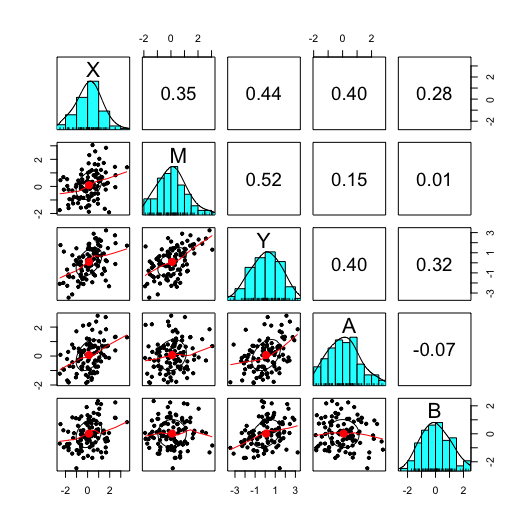

``` r
library(regsim)
library(dagitty)
library(semPlot)
library(lavaan)
library(psych)
```

`regsim` is an `R` package to make simulation quick and easy. It can be installed from github with the following `R` code.

``` r
# the following two lines need only to be run once 
install.packages("devtools")
devtools::install_github("mcbeem/regsim")

# add regsim's functions to R namespace so they can be used
library(regsim)
```

Example 1
=========

A researcher envisions the following true data-generating process:


And is interested in estimating the effect of *X* on *Y* using a linear regression model of the following form:

*Y*<sub>*i*</sub> = *b*<sub>0</sub> + *b*<sub>1</sub>(*X*<sub>*i*</sub>)+...+*e*<sub>*i*</sub>

where ... potentially contains the effect of a set of *covariates* or *adjustment variables*. In this case, those covariates could include any combination of *A*, *B*, or *M*. What are the consequences of different choices? Simulation is a useful technique for exploring the results of analytic decisions. One reason it is so useful is that the true model, and the correct effect of *X* → *Y*, is known. Thus, the estimates produced by linear regression can be compared to the known, true values.

Defining the Data Generating (True) Model
-----------------------------------------

The process of specifying the data generating model is simple.

1.  **Sketch the path diagram describing the true model**. The process begins by sketching out a path diagram of the relationships between the variables. The arrows indicate not only causation, but in this case also imply a linear functional form. Each arrow must be assigned a *path coefficient*; a regression slope describing how much the downstream variable will change in response to an isolated-one unit change of the upstream variable.

2.  **Classify the variables**. Next, the variables in the diagram are classified as either **exogenous** or **endogenous**. An exogenous variable has no arrow directed towards it; it has no in-system causes. An endogeous variable has at least one arrow directed toward it. In our example, variables *A* and *B* are exogenous, while *X*, *M*, and *Y* are endogenous.

3.  **Write models for the endogenous variables**. Each exogenous variable must be described in terms of its causes. The syntax is similar to `R`'s model formula used in `lm()` and many other model-fitting routines. In our example path diagram, *X*, *M*, and *Y* were endogenous, so a model for each one will need to be provided.

Let's begin by examining *X*, which is caused by *A* and *B* according to our diagram. In `R`'s formula syntax, we would write:

``` r
X ~ A + B
```

Where the `~` character is read "predicted by" or "regressed on." This formula corresponds to a regression model of the form:

*X*<sub>*i*</sub> = *b*<sub>0</sub> + *b*<sub>1</sub>(*A*<sub>*i*</sub>)+*b*<sub>2</sub>(*B*<sub>*i*</sub>)+*e*<sub>*i*</sub>

Since we are specifying the true model, we must provide values for parameters *b*<sub>1</sub> and *b*<sub>2</sub>. The intercept, *b*<sub>0</sub>, and the residual variance *e*<sub>*i*</sub> are nuisance parameters in many simulation application. We do not need to choose values for them when using `regsim()` to simulate data. The `regsim()` function uses the `simulateSEM()` function from the `lavaan` package to do the data generation.

Let's choose values of 0.5 for both *b*<sub>1</sub> and *b*<sub>2</sub>. The model for *X*, expressed in the proper syntax for `regsim()`, is as follows.

``` r
X ~ .5*A + .5*B
```

We must do the same for the endogenous variables *M* and *Y*. Variable *M* has only one arrow pointing to it, so its model has only one predictor variable, *X*. Choosing 0.5 as the path coefficient for *X* → *M*, *M*'s model is written:

``` r
M ~ .5*X
```

Finally, *Y* is caused by *A*, *B*, and *M*, so its model must include these variables. Sticking with 0.5 as our arbitrary value for all the path coefficients, the model for *Y* is written:

``` r
Y ~ .5*A + .5*B + .5*M
```

We will create an object called `true.model` that will be passed to `regsim()` to describe the model. It will consist of a quoted string including all three of the models specified above. These can all go on one line, or you can separate them with line breaks for readability.

``` r
true.model <- "X ~ .5*A + .5*B
               M ~ .5*X
               Y ~ .5*M + .5*A + .5*B"
```

By default, `regsim()` will sample the exogenous as well as the residuals for the endogenous variables from independent normal distributions. You can alter the distribution, to some extent, via the optional `kurtosis=` and `skewness=` arguments.

Defining the Fitted Model
-------------------------

The fitted model is the regression model that will be fitted to the simulated data sampled from the true model. This model is specified using `R` formula syntax. Here, we will specify a simple regression of *Y* on *X* with no covariates, and will save it an object called `fit.model`. **Note**: the fitted model's syntax must be a quoted string.

``` r
fit.model <- "Y ~ X"
```

Setting the other simulation parameters
---------------------------------------

We must make a few final decisions before running `regsim()`. They are:

-   `reps`: The number of times that the simulation-estimation process will be repeated. Here there is a tradeoff between the accuracy of the results and computation time. I suggest at least 1,000 reps, hopefully more, before interpreting the results too seriously.

-   `n`: The sample size generated for each rep.

-   `targetparm`: Which parameter's estimate and standard error should be scrutinized? This is expressed as a quoted string. It must be a variable from the right-hand side of the fitted model.

-   `targetval`: The true value of the relationship between the target parameter and the response variable as specified in the data generating model. In the path diagram considered in this example, the effect of *X* on *Y* is completely mediated by *M*.

By path tracing rules, the total effect of one variable on another when the effect is mediated is equal to the direct effect plus the indirect (mediated) effect. In this case, the direct effect is zero, because there is no direct *X* → *Y* path in the data generating model. The indirect effect is the product of all the path coefficients in the chain *X* → *M* → *Y*. In this case, the indirect effect is .5 × .5 = .25. We will use this value as our target value for *X*'s effect on *Y*.

Doing the simulation
--------------------

The simulation is performed using the `regsim()` function. The `true.model` and `fit.model` objects, previously created, are passed as arguments. The simulation results are stored in the `result` object. A random number seed has been specified for reproducibility.

``` r
set.seed(123)

result <- regsim(reps=1000, n=100, true.model=true.model, 
                 fit.model=fit.model, targetparm="X",
                 targetval=.25)
```

Before examining the results, let's verify that we specified the data generating model correctly. Running `plot()` on the `regsim()` output will produce a path diagram corresponding to this model.

``` r
plot(result)
```


This plot looks correct, but the path coefficients for *A* → *Y* and *B* → *X* are superimposed. We can try an alternate layout for the graph. See `?lavaan::semPaths` for details on the options (under 'layout'). In this case, the `"spring"` layout works better and avoids overplotting.

``` r
plot(result, layout="spring")
```


Having verified that the data-generating model was set up correctly, let's examine the `regsim()` output.

``` r
result
```

    ## $targetval
    ## [1] 0.25
    ## 
    ## $expected.b
    ## [1] 0.5843389
    ## 
    ## $bias
    ## [1] 0.3343389
    ## 
    ## $empirical.CI
    ##      2.5%     97.5% 
    ## 0.3788186 0.7775613 
    ## 
    ## $coverage
    ## [1] 0.104
    ## 
    ## $empirical.SE
    ## [1] 0.09922978
    ## 
    ## $analytic.SE
    ## [1] 0.10401
    ## 
    ## $RMSE
    ## [1] 0.3487395
    ## 
    ## $adjustment.sets
    ##  { A, B }

-   `$targetval` The true value of the target parameter, *β*, which was specified when the function was called. It is used to calculate bias, RMSE, and coverage.

-   `$expected.b` The mean value of the target parameter estimate across all the simulated repetitions, $E(\\hat{b})$.

-   `$bias` Bias is calculated as the difference between the true value of the target parameter and the mean value of its estimate across repetitions. $E(\\hat{b}) - \\beta)$

`regsim()` output includes a few other components which are not printed but are nonetheless available. The full contents can be inspected using the `str()` function.

``` r
str(result)
```

    ## List of 14
    ##  $ true.model     : chr "X ~ .5*A + .5*B\n               M ~ .5*X\n               Y ~ .5*M + .5*A + .5*B"
    ##  $ fit.model      : chr "Y ~ X"
    ##  $ b              : num [1:1000] 0.537 0.557 0.446 0.785 0.528 ...
    ##  $ data           :'data.frame': 100 obs. of  5 variables:
    ##   ..$ X: num [1:100] -0.6119 -1.0575 0.546 0.5743 0.0865 ...
    ##   ..$ M: num [1:100] -0.1687 -0.0344 0.8271 -1.0659 -0.9911 ...
    ##   ..$ Y: num [1:100] -1.142 0.265 2.891 0.386 0.381 ...
    ##   ..$ A: num [1:100] -0.161 -1.474 1.09 0.184 0.451 ...
    ##   ..$ B: num [1:100] 0.214 1.115 1.006 0.109 1.07 ...
    ##  $ true.DAG       : 'dagitty' Named chr "dag {\nA\nB\nM\nX [exposure]\nY [outcome]\nA -> X\nA -> Y\nA <-> B\nB -> X\nB -> Y\nM -> Y\nX -> M\n}\n"
    ##  $ targetval      : num 0.25
    ##  $ expected.b     : num 0.584
    ##  $ bias           : num 0.334
    ##  $ empirical.CI   : Named num [1:2] 0.379 0.778
    ##   ..- attr(*, "names")= chr [1:2] "2.5%" "97.5%"
    ##  $ coverage       : num 0.104
    ##  $ empirical.SE   : num 0.0992
    ##  $ analytic.SE    : num 0.104
    ##  $ RMSE           : num 0.349
    ##  $ adjustment.sets:List of 1
    ##   ..$ 1: chr [1:2] "A" "B"
    ##   ..- attr(*, "class")= chr "dagitty.sets"
    ##  - attr(*, "class")= chr [1:2] "regsim" "list"
    ##  - attr(*, "hidden")= chr [1:5] "data" "b" "true.model" "fit.model" ...

Because the fitted model is misspecified, the estimated effect of *X* → *Y* is biased. `regsim()` returns the parameter estimates across all of the repetitions in a list component `$b`. Below is a histogram with a superimposed density plot of the parameter estimates. The true value of the relationship is indicated with a dashed vertical red line. The locations of the 2.5th and 97.5th percentiles (representing the empirical 95% confidence interval) are indicated with dotted vertical lines.

``` r
hist(result$b, breaks=30, freq=FALSE,
     main="Parameter estimates for Y~X", xlab="b")
points(density(result$b), type='l')
abline(v=.25, col="red", lty="dashed", lwd=1.5)
abline(v=result$empirical.CI, lty="dotted")
```


``` r
psych::pairs.panels(result$data)
```



``` r
regsim(reps=1000, n=100, true.model=true.model, 
                 fit.model="Y~X+A+B", targetparm="X",
                 targetval=.25)
```

    ## $targetval
    ## [1] 0.25
    ## 
    ## $expected.b
    ## [1] 0.2435049
    ## 
    ## $bias
    ## [1] -0.006495071
    ## 
    ## $empirical.CI
    ##       2.5%      97.5% 
    ## 0.02176829 0.47546433 
    ## 
    ## $coverage
    ## [1] 0.942
    ## 
    ## $empirical.SE
    ## [1] 0.1167926
    ## 
    ## $analytic.SE
    ## [1] 0.1133802
    ## 
    ## $RMSE
    ## [1] 0.1169148
    ## 
    ## $adjustment.sets
    ##  { A, B }
